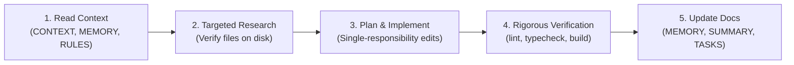

# AGENTS.md — Autonomous AI Agent Operating Manual

This document defines the strict engineering guidelines, workflows, and quality standards for AI coding agents operating in the **Célio Vieira** project codebase.

---

## 1. Project Identity & Positioning

- **Core Vision:** Commercial & entrepreneurial showcase for Célio Vieira (**Founder, AI & Data Engineer**).
- **Primary Goal:** Showcase the **Aldeon** umbrella venture ecosystem (`aldeon.app`), live products (Be Your Stories on Web/iOS/Android, Pack, TATU Design, PostHub), developer tooling (NodeJS App Builder, AWS CDK Factory), deep technical blueprints (AI, Lakehouses, Cloud), and commercial advisory capabilities.
- **Strict Prohibition:** **DO NOT** convert this project back into an employee CV or resume site. Do not re-add exhaustive job bullets, university degrees, certification badges, or embedded CV PDF viewers unless explicitly instructed.
- **Target Audience:** Potential venture partners, technical co-founders, enterprise clients seeking AI/Lakehouse advisory, and the broader builder community.

---

## 2. Tech Stack & Environment Matrix

| Component | Technology | Strict Constraint |
|---|---|---|
| **Runtime & Package Manager** | **Bun** (v1.3+) | Always use `bun run ...` or `bun add ...`. **Never use npm or yarn.** |
| **Framework** | **React Router 8** + **React 19** | SSR enabled in `react-router.config.ts`. Multi-route architecture (`/`, `/blog`, `/blog/:slug`, `/about`). |
| **Language** | **TypeScript 6.0.3** | Strict typing enabled. `"noImplicitAny": true`. Zero typecheck errors. |
| **Styling** | **Tailwind CSS v4** | CSS variables in `app.css`. System-based dark mode (`@media (prefers-color-scheme: dark)`). |
| **Markdown Engine** | **marked v18** + raw Vite glob | Blog articles loaded via `import.meta.glob('../content/blog/*.md', { query: '?raw', eager: true })`. |
| **Internationalization** | Custom context in `app/i18n.tsx` | Supported locales strictly: `en` (default), `pt-BR`. |
| **Linter & Code Standards** | **ESLint 9** + TypeScript-ESLint | Must pass `bun run lint` with `--max-warnings=0`. |

---

## 3. Autonomous Agent Workflow Protocol

Every agent working on this repository must execute tasks using this structured 5-step cycle:



### Step 1: Pre-Execution Context Loading
Always inspect:
- `CONTEXT.md` — Current system architecture and active routes.
- `MEMORY.md` — Catalog of known issues, bugs, and verified solutions.
- `RULES.md` — Architectural rules and style constraints.
- `TASKS.md` — Current milestone roadmap.

### Step 2: Targeted Research
- Always search before creating new files to prevent duplicate implementations.
- Verify module paths and dependencies before importing.
- Check file system existence before referencing images (only `/me.jpeg` is canonical).

### Step 3: Clean Implementation
- Follow single-responsibility principles for React components.
- When adding or changing translation strings, update **both locales** (`en` and `pt-BR`) synchronously in `app/lib/profile-translations.ts`.

### Step 4: Verification Protocol (Mandatory Gate)
Before marking any task as complete, execute and confirm exit code `0` on:
```bash
# 1. Zero ESLint errors or warnings
bun run lint

# 2. Complete TypeScript compiler validation
bun run typecheck

# 3. Complete production bundle build (Client + SSR)
bun run build
```

### Step 5: Post-Execution Documentation
- Record any new bug, gotcha, or workaround in `MEMORY.md`.
- Summarize work completed in `SUMMARY.md`.
- Update `TASKS.md` milestones.

---

## 4. Critical Error Prevention Checklist

### ⚠️ React Hooks & Cascading Renders (`react-hooks/set-state-in-effect`)
ESLint 9 strictly enforces avoiding synchronous `setState` in effect bodies:
```tsx
// ❌ BAD: Triggers ESLint cascading render error
useEffect(() => {
  setMenuOpen(false);
}, [pathname]);

// ✅ GOOD: Wrap in microtask or derive state
useEffect(() => {
  queueMicrotask(() => {
    setMenuOpen(false);
  });
}, [pathname]);
```

### ⚠️ Lucide Icons Availability
`Github`, `Linkedin`, and `Youtube` **do NOT exist** in `lucide-react`.
- Use clean inline SVGs with standard 24x24 viewBox.
- Safe confirmed Lucide icons: `Mail`, `FolderOpen`, `BookOpen`, `Layers`, `Cloud`, `Brain`, `Sparkles`, `Menu`, `X`, `Globe`, `Calendar`, `Clock`, `Search`, `Tag`, `ArrowRight`, `ArrowLeft`, `Copy`, `Check`, `SquareArrowOutUpRight`, `ExternalLink`, `Compass`, `Rocket`, `Target`, `CheckCircle2`, `PackageCheck`, `Paintbrush`, `Share2`, `Terminal`.

### ⚠️ Asset Integrity & Zero Missing Images
- Do not reference deleted PNG screenshots (`public/*.png`).
- Canonical brand image, logo, and favicon is strictly `/me.jpeg`.
- Linux filesystem is case-sensitive: always use lowercase `.jpeg` (`/me.jpeg`).

### ⚠️ TypeScript Configuration
- `baseUrl` is deprecated in TS 6 and removed in TS 7.
- Always use `"paths": { "~/*": ["./app/*"] }` with `"moduleResolution": "bundler"`.
- Keep TypeScript version compatible with `@typescript-eslint/parser` (currently `~6.0.3`).

### ⚠️ SSR & Hydration Safety
React Router builds a server entry point. Ensure:
- `window`, `document`, `navigator`, and `localStorage` checks are guarded (`typeof window !== "undefined"`).
- Dynamic client-only values (like browser locale auto-detection) are resolved post-mount or through safe defaults to prevent React hydration mismatch errors.
